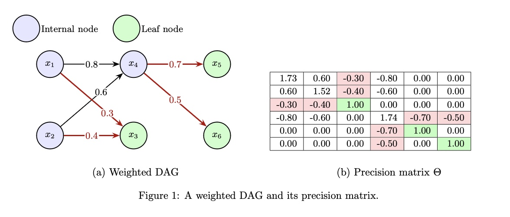

# BUILD: Bottom-Up Inference of Linear DAGs

BUILD is a novel algorithm for causal discovery that uses a bottom-up approach to efficiently discover Directed Acyclic Graphs (DAGs) from observational data. This implementation provides state-of-the-art performance in learning causal structures with improved scalability and accuracy.



## Overview
- **Deterministic**: introduces a deterministic algorithm to recover the structure of the DAG.
- **Linear DAG Focus**: Specialized for linear structural equation models.
- **Iterative Construction**: Builds DAG structure iteratively from bottom to top.
- **Robust to estimation errors**: Employing optional refreshing of the weights to curb estimation error propagation.

### Baselines
- **CoLiDE**: Both equal and non-equal variance implementations  
- **DAGMA**: Linear and non-negative variants with multiple optimization strategies  
- **Gao et al.**: Optimal estimation of Gaussian DAG models
- **Daskalasis et al.**: Learning Gaussian DAG Models without Condition Number Bounds
  
---


## References

### Key Papers

**BUILD Algorithm:**
```bibtex
@article{ajorlou2025build,
  title={BUILD: Bottom-Up Inference of Linear DAGs},
  author={Ajorlou, Hamed and Rey, Samuel and Mateos, Gonzalo and leus, Geert and García Marques, Antonio and},
  year={2025}
}
```

**Baseline Methods:**

**DAGMA:**
```bibtex
@article{bello2022dagma,
  title={DAGMA: Learning DAGs via M-matrices and a Log-Determinant Acyclicity Characterization},
  author={Bello, Kevin and Aragam, Bryon and Ravikumar, Pradeep},
  journal={Advances in Neural Information Processing Systems},
  volume={35},
  pages={8226--8239},
  year={2022}
}
```
**CoLiDE:**
```bibtex
@article{zhang2023colide,
  title={CoLiDE: Collaborative Linear DAG Estimation},
  author={Zhang, Xinyu and Zhang, Yujia and Zhang, Kun and others},
  journal={Advances in Neural Information Processing Systems},
  volume={36},
  year={2023}
}
```
**NOTEARS:**
```bibtex
@article{zheng2018dags,
  title={DAGs with NO TEARS: Continuous optimization for structure learning},
  author={Zheng, Xun and Aragam, Bryon and Ravikumar, Pradeep and others},
  journal={Advances in Neural Information Processing Systems},
  volume={31},
  year={2018}
}
```
**Graphical Lasso:**
```bibtex
@article{friedman2008sparse,
  title={Sparse inverse covariance estimation with the graphical lasso},
  author={Friedman, Jerome and Hastie, Trevor and Tibshirani, Robert},
  journal={Biostatistics},
  volume={9},
  number={3},
  pages={432--441},
  year={2008},
  publisher={Oxford University Press}
}
```
**GreedyPrune:**
```bibtex
@article{kelner2020greedy,
  title={Learning some popular {G}aussian graphical models without condition number bounds},
  author={Kelner, J. and Koehler, F. and Meka, R. and Moitra, A.},
  journal=NEURIPS,
  pages={1236--1249},
  year={2020}
}
```
### Additional References

For more information on causal discovery and DAG learning, see:

- **Causal Discovery Methods**: [Spirtes et al., 2000](https://doi.org/10.7551/mitpress/1754.001.0001)
- **Linear Structural Equation Models**: [Bollen, 1989](https://doi.org/10.1002/9781118619179)
- **Graphical Models**: [Koller & Friedman, 2009](https://mitpress.mit.edu/9780262013192/)

## Contributing

Contributions are welcome! Please feel free to submit a Pull Request.

## Citation

If you use this implementation in your research, please cite:

```bibtex
@software{build2024,
  author = {Ajorlou, Hamed and Rey, Samuel and Mateos, Gonzalo and Leus, Geert and García Marques, Antonio},
  title = {BUILD: Bottom-Up Inference of Linear DAGs},
  year = {2025},
  url = {https://github.com/hamedajorlou/BUILD}
}
```

## License

This project is licensed under the MIT License - see the LICENSE file for details.
